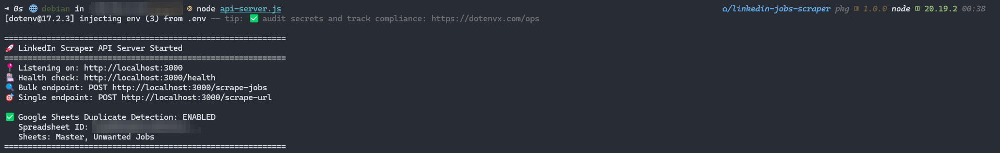
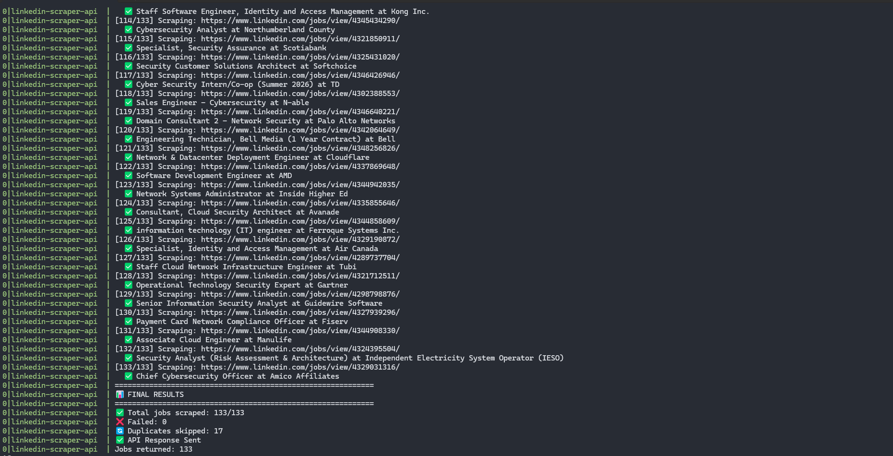

# LinkedIn Job Scraper with Google Sheets Integration

A robust Puppeteer-based scraper for LinkedIn job postings with built-in session persistence, duplicate detection via Google Sheets, and REST API interface.


## Features

- **Session Persistence** - One-time manual login, automatic session reuse
- **Google Sheets Integration** - Automatic duplicate detection across multiple sheets
- **Two-Step Scraping** - Fast URL collection, then selective detail scraping
- **External Application URLs** - Detects and extracts company career page links
- **Anti-Detection** - Stealth plugin and resource blocking to avoid bot detection
- **REST API** - Express server for easy integration with automation tools
- **Resource Optimized** - Blocks images, CSS, and fonts for 2-3x faster scraping

## Prerequisites

- Node.js 20.x or higher
- Chrome/Chromium (installed automatically with Puppeteer)
- Google Sheets API key (optional, for duplicate detection)
- LinkedIn account

## Installation

```bash
# Clone the repository
git clone https://github.com/Murali2602/linkedin-job-scraper.git
cd linkedin-job-scraper

# Install dependencies
npm install

# Create user data directory (for session storage)
mkdir user_Data
```

## Quick Start

### Step 1: One-Time Login

Before scraping, you need to authenticate with LinkedIn once:

```bash
node login.js
```

This will:
1. Open a Chrome browser window
2. Navigate to LinkedIn's login page
3. Wait for you to manually log in
4. Detect successful login automatically
5. Save your session to `./user_Data/`
6. Close the browser


Your session will persist across scraping runs. Re-run this script only when your session expires (typically every few weeks).

### Step 2: Run the Scraper
**REST API**

Start the API server:

```bash
npm start
# Server runs on http://localhost:3000
```



Make a scraping request:

```bash
curl -X POST http://localhost:3000/scrape-jobs \
  -H "Content-Type: application/json" \
  -d '{
    "searchUrl": "https://www.linkedin.com/jobs/search?keywords=security%20analyst&location=Toronto&f_TPR=r604800",
    "targetCount": 50
  }'
```

## Configuration

### Google Sheets Duplicate Detection

To enable automatic duplicate detection, provide a Google Sheets configuration:

```javascript
const googleSheetsConfig = {
  spreadsheetId: 'YOUR_SPREADSHEET_ID',
  apiKey: 'YOUR_GOOGLE_API_KEY',
  sheets: [
    {
      name: 'Master',           // Sheet name
      range: 'A:Z'              // Range to scan
    },
    {
      name: 'Unwanted Jobs',
      range: 'A:Z'
    }
  ]
};

const jobs = await scrapeLinkedInJobs(searchUrl, targetCount, googleSheetsConfig);
```

**Getting a Google Sheets API Key:**

1. Go to [Google Cloud Console](https://console.cloud.google.com/)
2. Create a new project or select existing
3. Enable "Google Sheets API"
4. Create credentials → API key
5. Copy the API key

**Sheet Requirements:**

- Must have a column header named exactly: `Job ID`, `JobID`, `job_id`, `ID`, or `id`
- Job IDs must be 10-digit LinkedIn job IDs (e.g., `3847562910`)
- Scraper will skip any job with an ID that appears in any configured sheet

### LinkedIn Search URL Parameters

Build your search URL at linkedin.com/jobs, then copy it. Key parameters:

| Parameter | Description | Example |
|-----------|-------------|---------|
| `keywords` | Job title/keywords | `security%20analyst` |
| `location` | Geographic filter | `Toronto%2C%20Ontario` |
| `f_TPR` | Time posted | `r604800` (last 7 days) |
| `f_JT` | Job type | `F` (full-time) |
| `f_E` | Experience level | `2` (entry level) |

Example search URL:
```
https://www.linkedin.com/jobs/search?keywords=security%20analyst&location=Toronto&f_TPR=r604800&f_JT=F&f_E=2
```

## API Documentation

### POST /scrape-jobs

Scrape LinkedIn job postings.

**Request Body:**

```json
{
  "searchUrl": "https://www.linkedin.com/jobs/search?keywords=...",
  "targetCount": 50,
  "googleSheets": {
    "spreadsheetId": "1BxiMVs0XRA5nFMdKvBdBZjgmUUqptlbs74OgvE2upms",
    "apiKey": "AIzaSyDemoKey123456789",
    "sheets": [
      { "name": "Master", "range": "A:Z" },
      { "name": "Unwanted Jobs", "range": "A:Z" }
    ]
  }
}
```

**Response:**

```json
{
  "success": true,
  "jobsScraped": 45,
  "duplicatesSkipped": 5,
  "jobs": [
    {
      "id": "3847562910",
      "title": "Security Analyst",
      "companyName": "Tech Corp",
      "companyLinkedinUrl": "https://www.linkedin.com/company/techcorp",
      "jobUrl": "https://www.linkedin.com/jobs/view/3847562910/",
      "applyUrl": "https://techcorp.com/careers/apply/12345",
      "location": "Toronto, Ontario, Canada",
      "postedAt": "2 days ago",
      "salaryInfo": "$70,000 - $90,000 / year",
      "descriptionText": "We are seeking...",
      "jobPosterName": "John Smith",
      "jobPosterTitle": "Senior Recruiter",
      "jobPosterProfileUrl": "https://www.linkedin.com/in/johnsmith",
      "applicantsCount": "47 applicants"
    }
  ]
}
```



### POST /scrape-single-job

Scrape a specific job by URL.

**Request Body:**

```json
{
  "jobUrl": "https://www.linkedin.com/jobs/view/3847562910/"
}
```

**Response:**

```json
{
  "success": true,
  "job": { /* same structure as above */ }
}
```

## Architecture

### Session Management (login.js)

- Launches Chrome with `userDataDir` pointing to `./user_Data/`
- Opens LinkedIn login page in visible browser
- Polls current URL every 1 second to detect successful login
- Waits 5 seconds after login for Chrome to flush profile data
- Closes browser safely, preserving session

### Two-Step Scraping (scraper.js)

**Step 1: URL Collection**
- Loads LinkedIn search results page
- Scrolls to trigger lazy-loaded job cards
- Extracts job IDs from `data-occludable-job-id` attributes
- Handles pagination to reach target count
- Returns array of job URLs

**Step 2: Duplicate Filtering**
- Fetches job IDs from configured Google Sheets
- Extracts 10-digit job IDs from URLs
- Compares against existing IDs
- Returns only new URLs to scrape

**Step 3: Detail Scraping**
- Opens each job URL individually
- Extracts all job details from page
- Handles external application URLs:
  - Clicks "Apply" button
  - Listens for new browser tabs
  - Captures external URLs when tabs open
  - Falls back to mailto or description URLs
- Returns structured job data

### Resource Optimization

Request interception blocks unnecessary resources:

```javascript
page.on('request', (req) => {
  const resourceType = req.resourceType();
  if (['image', 'stylesheet', 'font', 'media'].includes(resourceType)) {
    req.abort();
  } else {
    req.continue();
  }
});
```

Reduces bandwidth by 60-70% and improves scraping speed by 2-3x.

## Performance

**Typical Run (50 jobs):**
- URL Collection: ~2-3 minutes
- Duplicate Check: <5 seconds
- Detail Scraping: ~5-7 minutes (with 30 new jobs)
- Total: ~8-10 minutes

**With 100% Duplicates:**
- Completes in <30 seconds (only URL collection + filtering)

**Success Rate:**
- 95%+ successful job scrapes
- Main failures: LinkedIn security challenges, session expiration

## Environment Variables

Create a `.env` file for API configuration:

```env
PORT=3000
NODE_ENV=production

# Google Sheets (optional)
GOOGLE_SHEETS_API_KEY=your_api_key_here
DEFAULT_SPREADSHEET_ID=your_spreadsheet_id_here
```

## Troubleshooting

### "Session expired" or "Login required" errors

**Cause:** LinkedIn session has expired  
**Solution:** Run `node login.js` again to refresh your session

### No jobs returned

**Possible causes:**
1. Search URL is invalid or returns no results
2. LinkedIn changed their page structure
3. Rate limiting (too many requests)

**Solutions:**
- Test your search URL in a browser first
- Wait 10-15 minutes and try again
- Check console logs for specific errors

### Scraper getting blocked

**Symptoms:** Frequent CAPTCHAs or empty results  
**Solutions:**
- Increase delays between requests (edit `sleep()` values in scraper.js)
- Use a residential proxy
- Don't run multiple instances simultaneously

### Google Sheets integration not working

**Checklist:**
- API key is valid and has Sheets API enabled
- Spreadsheet ID is correct (from the URL)
- Sheet names match exactly (case-sensitive)
- Sheet has a column named `Job ID` (or variation)

### Missing application URLs

**Expected behavior:** 10-15% of jobs won't have clear application URLs  
**Fallback:** Scraper extracts any URL from description or email address

## Rate Limiting Best Practices

To avoid being blocked by LinkedIn:

- Don't exceed 100-150 jobs per scraping session
- Add 2-3 second delays between individual job scrapes (already built-in)
- Don't run multiple scrapers simultaneously on the same account
- Consider adding randomized delays for large scraping jobs

## Disclaimer

This tool is for personal use and educational purposes. Users are responsible for complying with LinkedIn's Terms of Service and robots.txt. The author is not responsible for any misuse or violations.

**Important:** Excessive or commercial scraping may violate LinkedIn's terms. Use responsibly and at your own risk.

## Acknowledgments

- Built with [Puppeteer](https://pptr.dev/)
- Anti-detection via [puppeteer-extra-plugin-stealth](https://github.com/berstend/puppeteer-extra/tree/master/packages/puppeteer-extra-plugin-stealth)
- Part of a larger [job automation system](https://github.com/Murali2602/Projects/tree/main/N8N-Job-Automation)

---

**Questions or issues?** Open an issue on GitHub or check existing issues for solutions.
