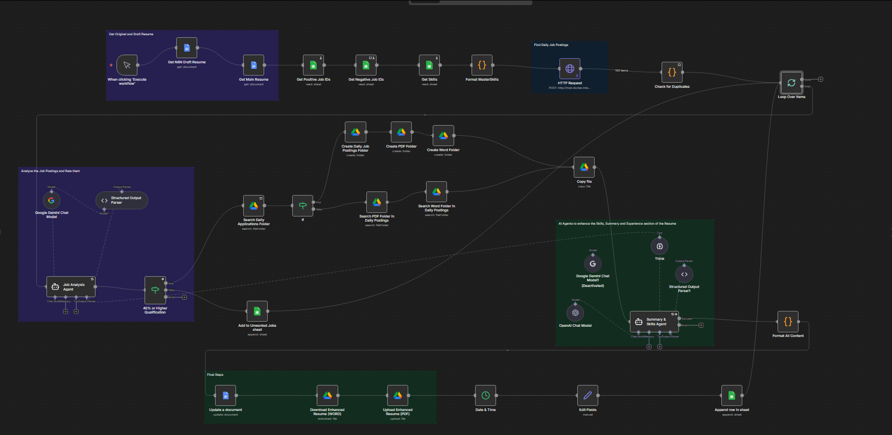

# AI-Powered Job Application Automation with N8N

An intelligent N8N workflow that automates cybersecurity job hunting by scraping LinkedIn postings, analyzing job fit with AI, and generating tailored resumes for qualified opportunities.


[](https://ezynix.com/projects/n8n-job-automation/)

## Overview

This automation processes 40-50 cybersecurity job postings daily, scoring each position based on skills match and automatically generating customized resumes for qualified roles (65%+ match). What used to take 2-3 hours of manual work now runs in 5-10 minutes.

**Blog Post** - [Read the full writeup](https://ezynix.com/projects/n8n-job-automation/)
**LinkedIn Job Scraper** - [Github Link](https://github.com/Murali2602/Projects/tree/main/LinkedIn-Job-Scraper)

---

### Key Features

- **Automated Job Scraping** - Fetches up to 100 daily cybersecurity jobs from LinkedIn
- **AI Job Analysis** - Uses ChatGPT with structured JSON output to rate job fit (0-100 score) based on your complete skill inventory
- **Smart Resume Tailoring** - ChatGPT optimizes Summary and Skills sections for each qualified job using role-specific keywords
- **Complete Tracking** - Logs everything to Google Sheets with links to tailored resumes
- **Auto Organization** - Creates dated folders with Word and PDF versions of each resume
- **Duplicate Prevention** - Cross-references multiple sheets to avoid reprocessing jobs
- **Token Optimization** - Leverages ChatGPT's structured output format to reduce API costs

## Architecture



## Tech Stack

- **Workflow Engine**: N8N (self-hosted)
- **AI Model**: OpenAI ChatGPT (GPT-5 / GPT-5-mini)
  - Job Analysis Agent with JSON Schema output
  - Resume Optimization Agent with structured formatting
- **Integrations**:
  - Google Docs API
  - Google Drive API
  - Google Sheets API
  - Custom LinkedIn Scraper (separate Node.js/Puppeteer service)
- **Output Parsing**: Structured JSON schemas with ChatGPT's native response formatting for token efficiency

## What's Included

- `n8n-job-automation-workflow.json` - Complete N8N workflow (import-ready)
- `README.md` - This file
- `job-analysis-prompt.txt` - Job matching system prompt with JSON schema
- `resume-optimization-prompt.txt` - Resume tailoring system prompt

## Setup Instructions

### Prerequisites

1. **N8N Installation** (self-hosted or cloud)
   ```bash
   docker run -it --rm --name n8n -p 5678:5678 -v ~/.n8n:/home/node/.n8n n8nio/n8n
   ```

2. **Required Google Cloud APIs** (enable in GCP Console):
   - Google Docs API
   - Google Drive API
   - Google Sheets API

3. **API Keys**:
   - Google Cloud Service Account (or OAuth2)
   - OpenAI API key (for ChatGPT)

4. **LinkedIn Scraper** (separate service - see scraper repo)
   - Must return JSON with: `id`, `title`, `companyName`, `location`, `descriptionText`, `applyUrl`, `jobUrl`

### Installation Steps

1. **Import Workflow**
   - Open N8N
   - Go to Workflows → Import from File
   - Select `n8n-job-automation-workflow.json`

2. **Configure Credentials**
   - Add Google Docs OAuth2 credentials
   - Add Google Drive OAuth2 credentials
   - Add Google Sheets OAuth2 credentials
   - Add OpenAI API credentials

3. **Set Up Google Workspace**

   **Create these Google Docs:**
   - Main Resume (your complete resume template)
   - Draft Resume (N8N-compatible template with `{Summary}` and `{Skills}` placeholders)

   **Create these Google Sheets:**
   - **MasterSkills Sheet** with columns:
     - `Category` (e.g., "Security Tools", "Programming")
     - `Skill` (e.g., "Wireshark", "Python")
     - `Level` (basic/intermediate/advanced)
     - `Evidence` (homelab/co-op/certification/college/personal project)

   - **Job Applications Tracker** with sheets:
     - `Master` - For qualified jobs
     - `Unwanted Jobs` - For rejected jobs (<65% match)

   **Create Google Drive folder structure:**
   ```
   Job Postings/
   ├── Cybersecurity Jobs/
   ```

4. **Update Node References**

   Replace `YOUR_DOCUMENT_ID` placeholders with your actual IDs:
   - `Get Main Resume` node → Your main resume Doc ID
   - `Get N8N Draft Resume` node → Your draft template Doc ID
   - `Get Skills` node → Your MasterSkills Sheet ID
   - `Append row in sheet` nodes → Your tracker Sheet ID
   - `Create Daily Job Postings Folder` node → Your root folder ID

5. **Configure LinkedIn Scraper**
   - Update `HTTP Request` node with your scraper endpoint
   - Modify search parameters (keywords, location, date range)

6. **Configure AI Agent JSON Schemas**
   
   Both ChatGPT agents use structured JSON output for consistency and token savings:
   
   **Job Rating Agent** - Returns:
   ```json
   {
     "properties": {
       "company_name": {"type": "string"},
       "job_title": {"type": "string"},
       "rating": {"type": "number"},
       "maxRaw": 100,
       "required": ["company_name", "job_title", "rating"]
     }
   }
   ```
   
   **Summary & Skills Agent** - Returns formatted resume sections as plain text

7. **Test the Workflow**
   - Click "Execute workflow" button
   - Monitor each node's output
   - Check Google Sheets for logged jobs
   - Verify resume generation in Google Drive

## Customization Guide

### Adjusting Job Match Threshold

In the `45% or Higher Qualification` node:
```javascript
{{ $json.output.rating.toNumber() }} >= 65  // Change 65 to your threshold
```

### Switching ChatGPT Models

Update the OpenAI Chat Model node:
- **GPT-5**: Best accuracy, higher cost (~$0.20/100 jobs)
- **GPT-5-mini**: Balanced performance, lower cost (~$0.15/100 jobs) ← Recommended
- **GPT-3.5-turbo**: Fastest, cheapest, but less reliable for complex prompts

### Search Parameters

Edit the `HTTP Request` node JSON body:
```json
{
  "searchUrl": "https://www.linkedin.com/jobs/search?keywords=YOUR_KEYWORDS&location=YOUR_LOCATION&f_TPR=r604800&f_JT=F",
  "targetCount": 100
}
```

Parameters:
- `keywords` - Job title/role keywords
- `location` - Geographic filter
- `f_TPR=r604800` - Posted in last 7 days (604800 seconds)
- `f_JT=F` - Full-time only
- `targetCount` - Max jobs to fetch

## AI Agent Prompts

### Job Analysis Agent (ChatGPT)
- Compares job requirements against MasterSkills inventory
- Considers skill proficiency levels (basic/intermediate/advanced)
- Evaluates experience context (homelab vs. professional)
- Returns structured JSON with 0-100 match score and detailed justification
- Uses JSON Schema output format to reduce token usage and ensure consistent responses

### Resume Optimization Agent (ChatGPT)
- Rewrites Summary with 7-10 job-specific keywords
- Creates 3-5 dynamic skill categories matching job posting language
- Prioritizes relevant skills from MasterSkills
- Maintains authenticity (only includes verified skills)
- Uses accurate experience attribution (homelab/co-op/college)
- Outputs plain text for direct Google Docs insertion

## Output Examples

### Google Sheets Tracker
| Date | Company Name | Job Title | Rating | Enhanced Resume | Apply URL | Status |
|------|--------------|-----------|--------|-----------------|-----------|--------|
| 2025-12-10 | Acme Corp | Security Analyst | 78 | [Doc Link] | [Apply] | Ready |
| 2025-12-10 | Tech Inc | SOC Analyst | 82 | [Doc Link] | [Apply] | Applied |

---

### Generated Resume Structure
```
Professional Summary (tailored)
───────────────────────────
3-4 sentences with job-specific keywords

Skills (dynamic categories)
───────────────────────────
• SECURITY OPERATIONS & SIEM
  Splunk, Wazuh, Security Onion, QRadar, ELK Stack...

• NETWORKING & INFRASTRUCTURE
  Wireshark, TCP/IP, VLANs, pfSense, Suricata...

• CLOUD & IDENTITY MANAGEMENT
  AWS, Azure AD, Okta, IAM policies...

[Rest of original resume unchanged]
```

## Troubleshooting

### Common Issues

**"No jobs returned"**
- Check scraper is running (`curl http://localhost:3000/scrape-jobs`)
- Verify LinkedIn search URL returns results in browser
- Check rate limiting/captcha issues in scraper logs

**"AI agent timeout"**
- Increase timeout in node settings (Options → Timeout)
- Simplify prompts or reduce MasterSkills inventory size
- Check OpenAI API rate limits

**"JSON parsing errors"**
- Verify JSON Schema is properly configured in ChatGPT agent node
- Check that response format is set to "JSON Schema (Recommended)"
- Review prompt to ensure it requests valid JSON output

**"Resume not generated"**
- Verify `{Summary}` and `{Skills}` placeholders exist in draft template
- Check Google Docs API permissions
- Review `Format All Content` node output for errors

**"Duplicate jobs appearing"**
- Ensure Job ID columns exist in both tracker sheets
- Check `Check for Duplicates` node is executing
- Verify sheet names match exactly

---

## Performance & Costs

**Execution Time**: 10-20 minutes for 40-50 jobs

**API Costs** (approximate per run with GPT-5-mini):
- OpenAI ChatGPT: ~$0.15 per 100 jobs (both agents combined)
  - Job Analysis: ~$0.04
  - Resume Generation: ~$0.11
  - *Optimized through structured JSON output and efficient prompting*
- Google Workspace APIs: Free
- **Total**: ~$0.15 per workflow run (80-100 jobs)

**Monthly Cost** (daily runs): ~$4.50

**Token Optimization Techniques:**
- JSON Schema structured output reduces unnecessary verbosity
- Compressed MasterSkills format (`skill|level|source`)
- Reusable system prompts across all jobs
- Efficient context management in prompts

## Security & Privacy

- All data stored in your Google Workspace
- API keys stored in N8N credentials (encrypted)
- No third-party data sharing
- Resume data never leaves your infrastructure
- LinkedIn scraper should respect robots.txt and rate limits

**⚠️ Disclaimer**: This tool is for personal use. Ensure compliance with LinkedIn's Terms of Service and use rate limiting to avoid account restrictions. The author is not responsible for any misuse.
